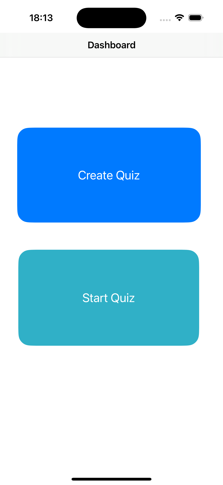
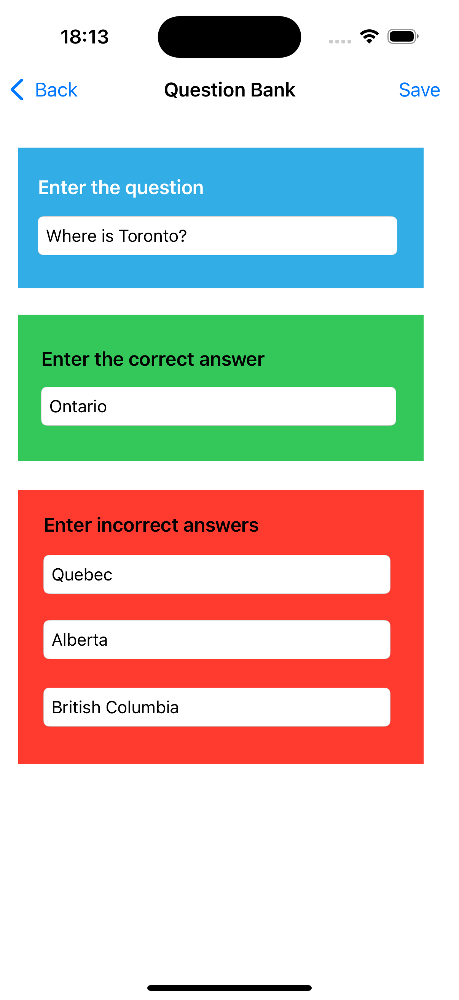
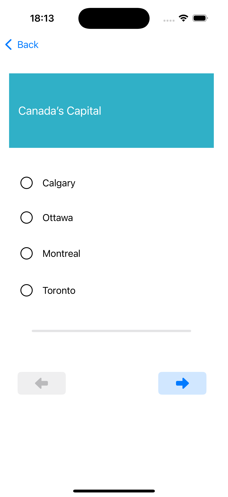
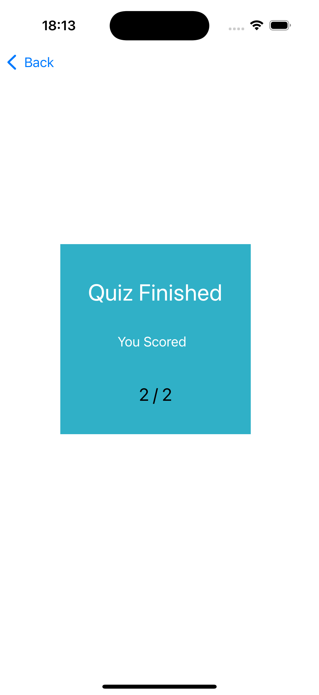

# Quiz App

## Overview
The Quiz App is an iOS application that allows users to create, manage, and play a quiz. The app features a question bank for storing custom questions, a quiz mode for answering questions, and a result display to track performance. It is built using UIKit with multiple screens and custom protocols to handle data passing.

## Demo
A video demonstrating the app, its features, and input validation can be found here: [Demo](https://humberital-my.sharepoint.com/:v:/g/personal/n01605453_humber_ca/EaXx6fQvMcVLi-9x09547fMBTjG55Fg-1SAgdSyUND7hAQ?nav=eyJyZWZlcnJhbEluZm8iOnsicmVmZXJyYWxBcHAiOiJPbmVEcml2ZUZvckJ1c2luZXNzIiwicmVmZXJyYWxBcHBQbGF0Zm9ybSI6IldlYiIsInJlZmVycmFsTW9kZSI6InZpZXciLCJyZWZlcnJhbFZpZXciOiJNeUZpbGVzTGlua0NvcHkifX0&e=GZtEE1)

## Screenshots
<div style="display: flex; flex-wrap: wrap; gap: 10px;">
  
  
  
  
  
</div>

## Features
1. Question Bank
Add new questions with one correct answer and three incorrect answers.
Edit existing questions.
View a list of all questions in the bank.
2. Quiz Mode
Randomly display questions from the question bank.
Provide answer options as radio buttons.
Track progress with a progress bar.
3. Results Screen
Display the average score or performance after completing the quiz.

## Technologies Used
- Programming Language: Swift
- Framework: UIKit
- Design Tool: Storyboard
- Version Control: Git/GitHub

## Setup Instructions
### Prerequisites
- Xcode 14 or later installed on your Mac.
- Basic knowledge of Swift and UIKit.

### Steps to Run
1. Clone the repository:
```git clone https://github.com/r-sachdeva3105/QuizApp/```

2. Open the project in Xcode:
```open QuizApp.xcodeproj```

3. Select a simulator (e.g., iPhone 15 pro).
4. Build and run the app using Command + R.
